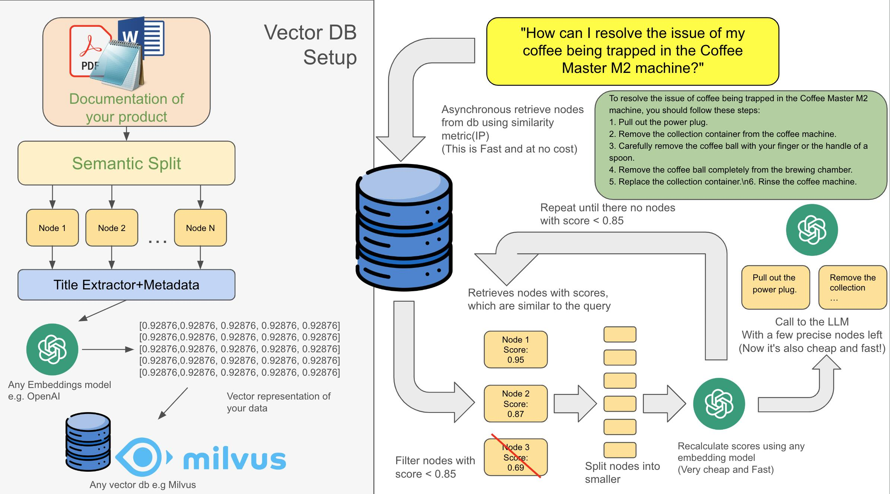

# LLM Bot

This is a bot for finding data in the local context of your documents. It works by prompt engineering with LLM model, this application can add your context to LLM without finetuning. It has English prompts, and work better with English, change `text_qa_template`, `refine_template_str`, `system_prompt` as you need with your language. You can upload new knowledge or delete one. You should have an OpenAI token for it to work. Please add your token to the .env file. You may also want to host your embedding database somewhere(AWS), please specify your hosted db IP address in the .env file too, or leave it alone if you want local usage, which is not recommended for production by the way.

## Specs:
* Milvus for vector db
* LlamaIndex as RAG framework
* ChatGPT as LLM(Can be changed)
* BAAI/bge-m3 as embedding models (1024 chunk size)
* FastAPI
* Everything inside docker containers (see docker-compose)
  
## How to install

### Prerequisites
* You need `poetry` and `docker`

### Installation process:
* add your OpenAI token to the .env file
* `poetry install`
* `poetry shell` for the local environment
* `docker-compose up --build -d`
### For debugging
* In VSCode just attach process, it already has implemented debugpy. Don't forget to change env of container in docker-compose.yml

## Usage

This app is working on fastAPI, so you can connect it to any app you need. You also can add your own API-key for security of this API.
`/message` is for chatting, it can handle even some memory in dialogue. 
`/documents` is for managing your documents. (Adding deleting, etc.) 
